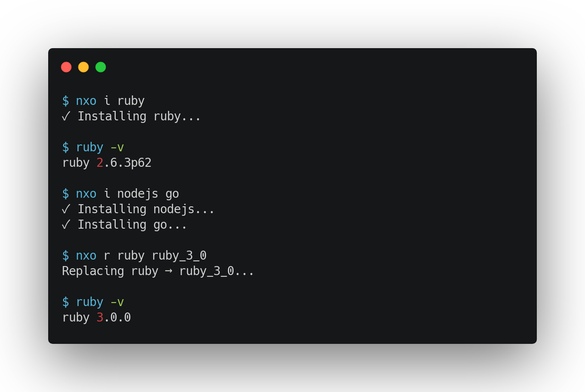

# nxo

`nxo` is a command line utility to bootstrap simple configuration for [nix](http://nixos.org). It provides syntactic sugar and sane defaults to get you up and running with nix as quickly as possible.



---

### Installation

Before installing `nxo` you'll need;
* [`nix`](https://nixos.org/download.html#nix-install-macos) 
* [`direnv`](https://direnv.net/docs/installation.html)

The easiest way to install is to download the binary:

```bash
curl -L https://github.com/almonk/nxo/releases/download/v0.0.4/nxo_darwin_arm64 --output /tmp/nxo && chmod +x /tmp/nxo && sudo mv /tmp/nxo /usr/local/bin
```

Be sure to swap `nxo_darwin_arm64` for `nxo_darwin_amd64` if you are using an Intel Mac.

---

### Usage

Setup a project with ruby and go dependencies:

```
$ nxo install ruby go
```

Let's add sqlite to this project as well. Simply run `nxo install` again:

```
$ nxo i sqlite # `nxo i` is a shortcut for install
```

`nxo` will generate the `shell.nix` below;

```nix
{ pkgs ? import <nixpkgs> {}
}:

pkgs.mkShell {
  buildInputs = [
    pkgs.ruby
    pkgs.go
    pkgs.sqlite
  ];
}
```

To wipe nix config:

```
$ nxo clean
```

or 

```
$ nxo c
```

---

### Uninstallation

```
rm -rf /usr/local/bin/nxo
```

---

### Build from source

To build `nxo` from source locally:

```
$ git clone [this repo]
$ make release
```